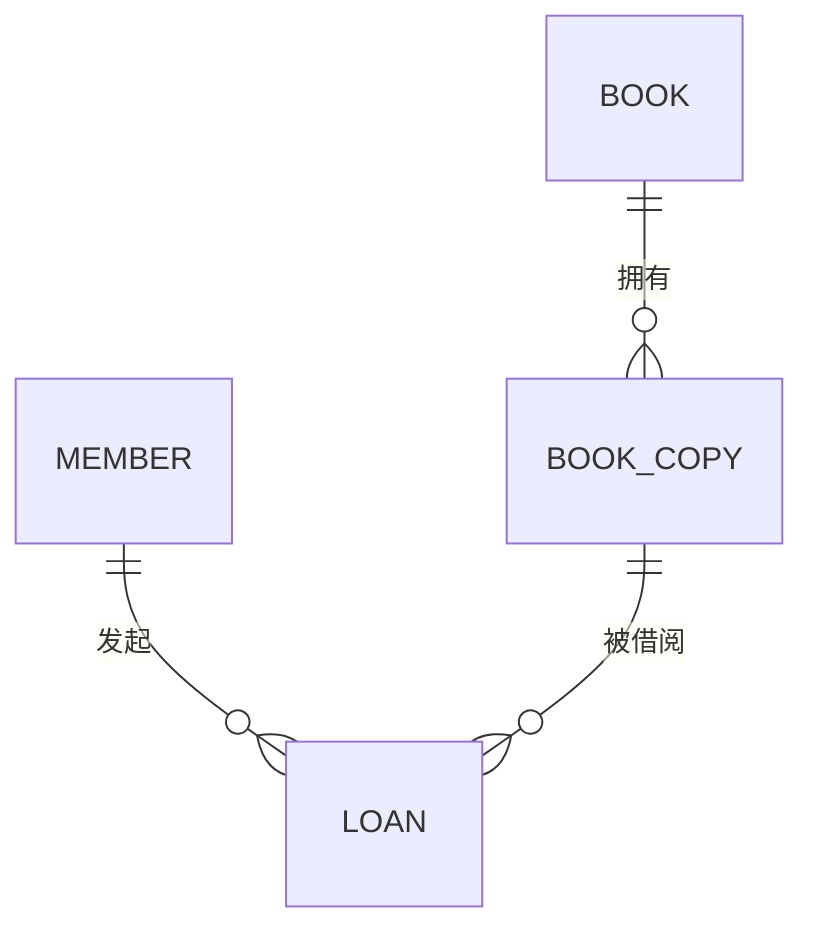

# S1 数据模型与 ER 图基础：用图书馆借阅理解业务事实建模

这一阶段仍属于 S1，但关注点已经从“根据名词建表”转向了“识别并保存业务事实”。

为了让主线更清楚，下面只使用一个简单案例：图书馆借阅。

## 一、案例需求

图书馆需要记录：

- 会员；
- 图书；
- 每本图书对应的馆藏副本；
- 会员借出、归还副本的历史；
- 一册副本可以被反复借阅；
- 同一时刻，一册副本最多只有一笔未归还的借阅。

例如，《数据库系统概念》是一本图书，图书馆购买了三册实体书。三册书内容相同，但条码、位置和借阅状态不同，因此要分别管理。

这个案例看起来简单，却足以覆盖本阶段最重要的建模问题。

## 二、先找业务实体

### 1. 图书与馆藏副本必须分开

```text
图书 BOOK
- book_id
- title
- author
- isbn

馆藏副本 BOOK_COPY
- copy_id
- book_id
- barcode
- shelf_location
```

`BOOK` 表示可被描述的图书信息；`BOOK_COPY` 表示图书馆实际拥有的一册实体书。

如果只建立“图书”实体，就无法准确回答：

- 借走的是哪一册；
- 哪一册已经损坏；
- 哪一册仍在馆内；
- 每一册分别被借过多少次。

判断一个概念是否应该成为实体，不能只看它是不是名词，而要看它是否：

- 需要独立标识；
- 拥有自己的属性；
- 具有独立生命周期；
- 会被其他数据引用；
- 需要单独保存历史。

### 2. 借阅不是会员或副本的普通属性

最简单但错误的做法，是在副本上保存：

```text
current_borrower_id
borrowed_at
```

这只能表示当前状态，无法保存同一册书多次借阅的历史。

借阅本身包含：

- 谁借的；
- 借了哪一册；
- 何时借出；
- 何时归还；
- 当前是否逾期或丢失。

因此它是一个具有自身属性和生命周期的业务事实，应独立建模：

```text
借阅 LOAN
- loan_id
- member_id
- copy_id
- borrowed_at
- returned_at
- status
```

核心认识是：

> 当一段关系拥有自己的属性、生命周期或历史时，这段关系本身就应成为实体。

## 三、主键、候选键与业务唯一性

各实体需要稳定标识：

```text
MEMBER.member_id
BOOK.book_id
BOOK_COPY.copy_id
LOAN.loan_id
```

这些主键回答的是：

> 这是哪一个会员、哪本书、哪一册副本、哪一次借阅？

馆藏条码 `barcode` 也可以唯一识别副本，因此它是候选键。但系统仍可以使用内部生成的 `copy_id` 作为主键，把条码作为业务唯一字段。

两者分工不同：

```text
copy_id
→ 系统内部稳定引用

barcode
→ 图书馆业务中的副本编号
```

主键唯一也不等于所有业务规则都已满足。例如，两条借阅记录可以有不同的 `loan_id`，却都表示同一册书在同一时间处于未归还状态。数据库记录没有重复，业务事实仍然冲突。

因此还需要额外约束：

> 任意时刻，一册馆藏副本最多只能存在一条有效借阅记录。

## 四、关系基数必须从两端判断

完整关系如下：

```text
图书 1 —— N 馆藏副本
会员 1 —— N 借阅记录
馆藏副本 1 —— N 借阅记录
```

但只写 `1:N` 仍不够，还应分别说明最小和最大基数。

### 图书与馆藏副本

```text
对一本图书：馆藏副本为 0..N
对一册副本：所属图书为 1..1
```

图书信息可以先进入目录，因此可能暂时没有副本；每册副本必须对应一本图书。

### 会员与借阅记录

```text
对一个会员：历史借阅记录为 0..N
对一条借阅记录：会员为 1..1
```

会员可能从未借过书；每条借阅记录必须属于一个会员。

### 馆藏副本与借阅记录

```text
对一册副本：历史借阅记录为 0..N
对一条借阅记录：馆藏副本为 1..1
```

这里的 `0..N` 表示一册书在整个生命周期中可以发生多次借阅，不表示它能同时借给多人。

因此必须区分：

```text
关系基数
→ 生命周期中能产生多少条历史记录

时间约束
→ 同一时刻允许多少条有效记录
```

## 五、M:N 关系为什么要拆解

从长期历史看：

```text
会员 M —— N 馆藏副本
```

一个会员可以借过多册书，一册书也可以先后被多个会员借阅。

这个 M:N 关系应通过 `LOAN` 拆解：



拆解后得到：

```text
会员 1 —— N 借阅记录
馆藏副本 1 —— N 借阅记录
```

`LOAN` 不只是连接两端的中间表，还保存了这次关系自身的属性：借出时间、归还时间和状态。

## 六、两个外键不一定能唯一标识关联记录

如果规定：

```text
UNIQUE(member_id, copy_id)
```

就意味着同一会员一生只能借同一册书一次。

但真实需求允许：

```text
第一次借阅 → 归还 → 第二次借阅
```

因此同一组 `member_id + copy_id` 会重复出现。每次借阅都要由独立的 `loan_id` 标识。

判断两个外键能否组成唯一键，关键不在于它们是否连接了两个实体，而在于：

> 同一对实体之间，是否允许重复发生同类业务事实？

如果允许重复发生，就不能简单把两个外键设为永久唯一。

## 七、当前状态与历史事实不能混为一谈

图书馆经常查询：

```text
这册书现在是否可借？
这个会员现在借了哪些书？
```

但系统还要回答：

```text
这册书过去被谁借过？
这个会员过去借过哪些书？
```

两类问题不同：

| 数据 | 回答的问题 |
| --- | --- |
| 当前状态 | 现在是什么情况 |
| 借阅历史 | 过去发生过什么 |
| 展示快照 | 当时显示了什么 |
| 稳定身份 | 当时涉及的是哪个业务对象 |

在简单模型中，可以通过 `LOAN.returned_at IS NULL` 找出当前借阅；数据规模和查询压力增加后，也可以单独维护当前状态投影。但无论如何，当前状态都不能替代借阅历史。

这建立了本阶段很重要的时间意识：

> 当前状态是历史变化后的结果，但它不是历史本身。

## 八、ER 模型与查询过程不是一回事

ER 图描述系统需要保存哪些事实，以及事实之间有什么关系。

实际查询则围绕具体操作展开。例如打开“我的借阅”页面，通常只需要：

```text
用 member_id 查询当前未归还借阅
→ 批量取得对应副本
→ 批量取得对应图书信息
```

查看历史时，则按 `member_id + borrowed_at` 分页查询。

因此：

> ER 图中存在关系，不代表每次操作都要把整张 ER 图全部 Join 一遍。

可以把两者区分为：

| 模型 | 解决的问题 |
| --- | --- |
| ER/数据模型 | 系统要保存哪些业务事实 |
| 查询模型 | 某个操作怎样高效读取所需数据 |

S1 主要解决前者，但真实建模还要用典型查询反向检查模型是否可用。

## 九、本阶段形成的建模方法

面对新需求，可以按以下顺序分析：

1. 找出需要独立识别的业务对象；
2. 判断哪些是实体，哪些只是属性；
3. 为每个实体确定稳定主键；
4. 找出候选键和业务唯一约束；
5. 用业务动词识别实体之间的关系；
6. 从两端分别判断最小、最大基数；
7. 检查是否存在 M:N 关系；
8. 判断关系是否有自己的属性和生命周期；
9. 检查同一关系能否重复发生；
10. 区分当前状态、历史事实和展示快照；
11. 根据典型查询反查模型是否容易使用；
12. 用边界条件攻击当前模型。

在图书馆案例中，最后一步可以继续追问：

```text
同一会员能否重复借同一册书？
图书信息存在时，是否必须已经有副本？
副本丢失后，历史借阅是否保留？
会员注销后，借阅历史是否保留？
一册书能否同时存在两条未归还记录？
```

模型不是一次完成的。每增加一个边界条件，都要重新检查原模型还能否准确保存业务事实。

## 十、当前学习状态

本阶段已经形成的能力包括：

- 区分概念模型、逻辑模型和物理模型；
- 识别实体、属性、主键、候选键和外键；
- 从关系两端判断最小、最大基数；
- 将 M:N 关系拆解为关联实体；
- 判断关联关系是否允许重复发生；
- 区分稳定身份、当前状态和历史事实；
- 区分 ER 模型与实际查询过程；
- 用边界条件检验模型。

但目前仍不能宣布 S1 通关，因为还没有完成：

- 弱实体的正式学习；
- 超类型—子类型与继承的正式学习；
- 2 道错误 ER 图找茬题；
- 1 道全新业务即时建模题。

当前结论是：

> 已经从“按名词建表”迈入“围绕业务事实建模”，但仍需补齐进阶元素并通过正式验收。
